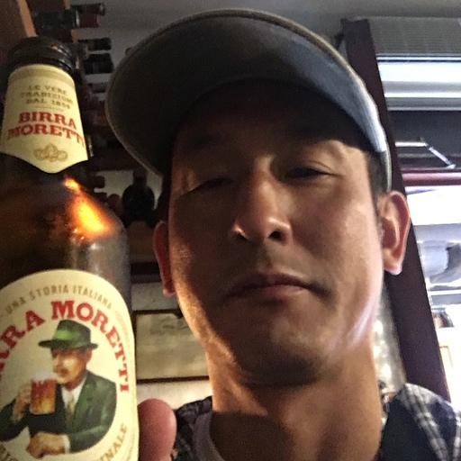

# 自己紹介
## 名前：川嶋 一寿（かわしま かずひさ）

## 職業
新卒から 30年ほど IT 業界で働いています。  
現在はサイボウズ株式会社で [グローバル版 Kintone](https://www.kintone.com/en-us/) の開発・運用を担当しています。  
また、専門学校で AWS を利用したクラウドの授業を 5年間担当しています。

## 今まで住んだことがある場所
- 静岡市（現住所）
- 藤枝市
- 金沢市
- 横浜市
- 川崎市

## 趣味
- 酒を飲むこと  
好きなお酒はウィスキーです。前はよくショットバーに通ってましたが、最近はお店に行くことが少なくなり、家で飲むことが多いです。
- 運動（水泳、ジョギング）  
数年前まではマラソン大会にも出場してましたが、最近は膝が痛くてあまり走れていません。
- バイクに乗ること  
途中７年くらい乗らない時期がありましたが、10代の頃からバイクに乗っています。  
今までに乗ったバイクは以下です。  
    - TAMAHA RZ250R
    - TAMAHA R1-Z
    - DUCATI ST2
    - DUCATI Monster 1000S
    - TAMAHA MT-25
    - DUCATI Monster + <-= Now!

## 経歴
新しい順番

1. [サイボウズ株式会社](https://cybozu.co.jp/) (2022年 7月 ー)  
    - 海外版 Kintone の開発・運用を担当  
      海外版 Kintone は AWS 上で動作している

2. [株式会社ゆめみ](https://www.yumemi.co.jp/) (2019年 6月 ー 2022年 6月)  
    - スマフォアプリや EC サイトのサーバサイドの機能の開発・運用を担当

3. [富士通株式会社](https://www.fujitsu.com/jp/) (1999年 5月 ー 2019年 5月)  
    - ミドルウェア製品の開発

4. [エヌ・ケー・エクサ](https://www.exa-corp.co.jp/) (1994年 4月 ー 1999年 4月)  
    - 業務アプリケーションの開発

## 活動
* [AWS ハンズオン教材](https://docs.kawashima-kazuh.com/)
* twitter：@cupperservice
* Github：https://github.com/cupperservice
* Speaker Deck：https://speakerdeck.com/cupperservice
