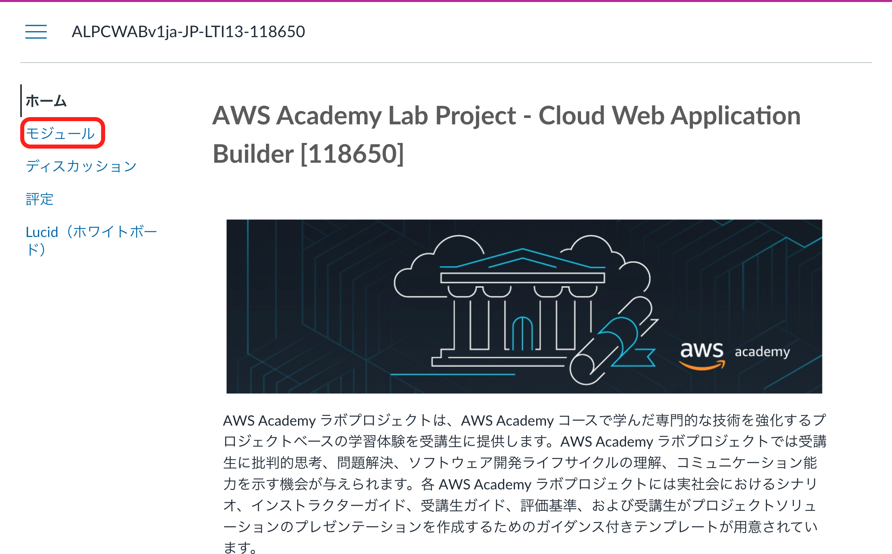
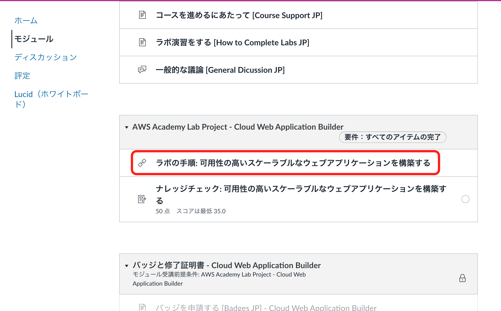
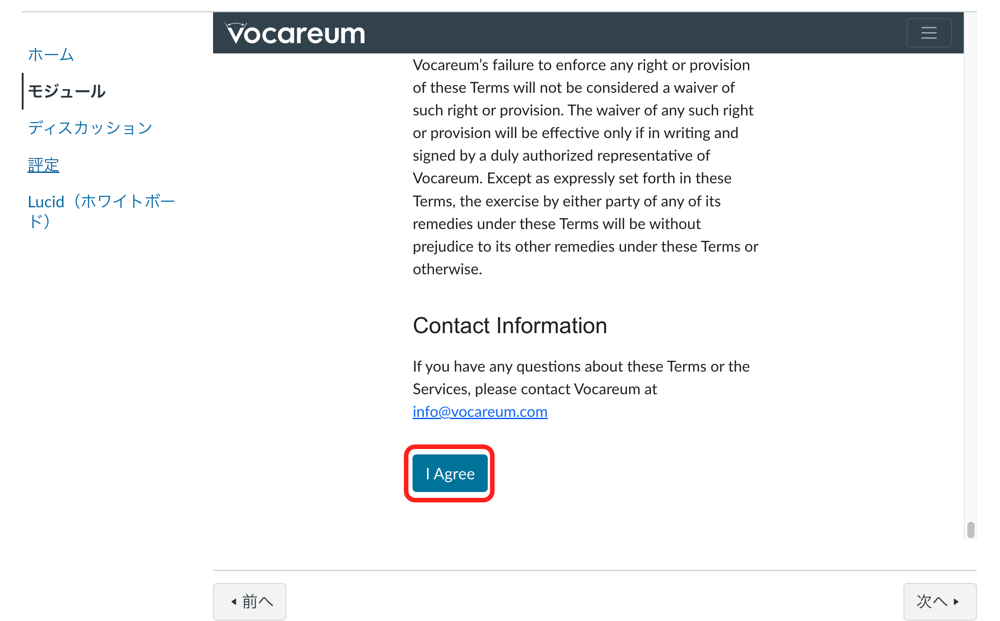
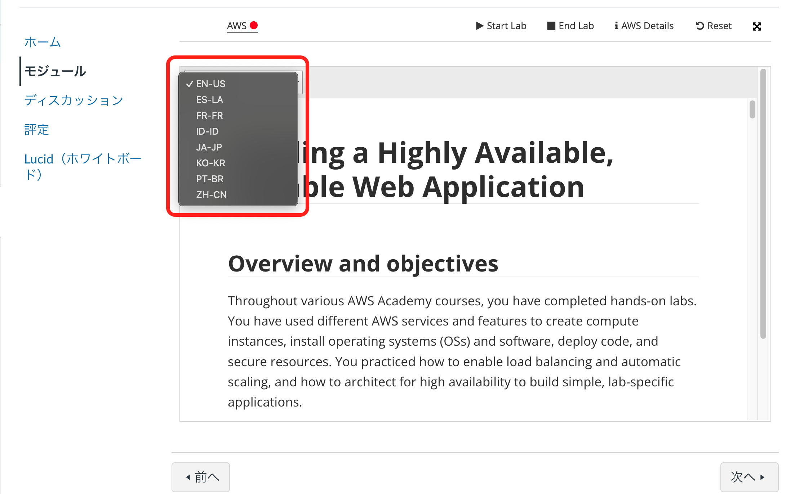
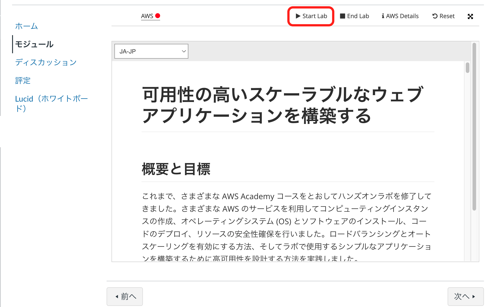
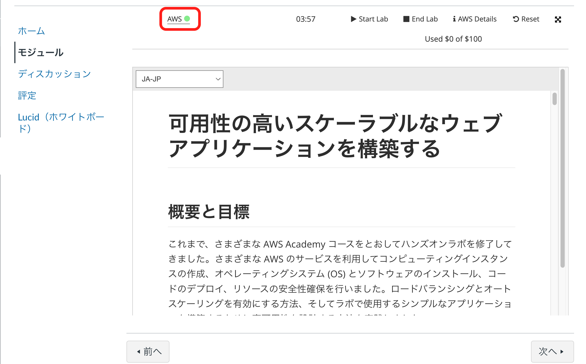
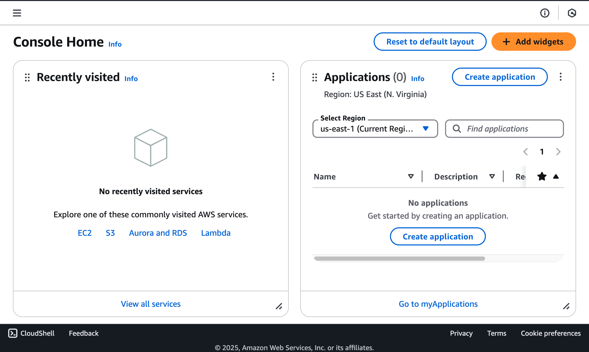

# オリエンテーション
## 自己紹介
- [川嶋の自己紹介](../Introduce_Myself/index.md)
- みなさんの自己紹介  
  みなさんのメールアドレス宛に届いている Google フォームから回答してください。  
  表題: 2025年度 セキュリティネットワーク科 自己紹介

## 授業に必要な前提知識
本授業では以下に示す前提知譓が必要です。

- Linux の基本的な操作  
  例: ファイル操作、プロセス操作、ネットワーク操作
- ネットワークの基本的な理解
- 簡単な英語読解力(翻訳サイトや ChatGPT などで翻訳して良い)  
  英語のエラーメッセージを読んで対処する必要がある場合があります。

## 授業内容の説明
この授業では以下を実施します。

### AWS Academy Web Application Builder
AWS Academy Web Application Builder の環境を使用して AWS の環境上に Web アプリケーションを構築します。  
ハンズオン形式で実施手順を指示するので、その手順に従って作業を進めて AWS 上にどのように Web アプリケーションを構築するかを学びます。

### AWS Academy Cloud Foundations
ここでは、AWSの概要、コアサービスやセキュリティ、アーキテクチャ、料金体系、サポートなどについて学んでいきます。

### AWS Academy Cloud Security Foundations
ここでは、AWSのセキュリティに関する基本的な知識を学びます。

### [Kintone](https://kintone.cybozu.co.jp/) を利用した業務システムの構築
Kintone は、サイボウズが提供するクラウド型の業務アプリケーションプラットフォームです。  
ここでは、Kintone のアプリ作成の基本および、JavaScript を利用したアプリのカスタマイズの方法を学びます。

## 成績について
この授業では期末の試験はありません。  
成績は以下のように評価します。

- AWS Academy Web Application Builder  
    - システム構築の進捗状況
    - ナレッジチェック

- AWS Academy Cloud Foundations  
    - ラボの提出
    - 知識確認テスト

- AWS Academy Cloud Security Foundations  
    - ラボの提出
    - ナレッジチェック

- Kintone を利用した業務システムの構築  

## 授業の準備
### AWS Academy のアカウントの登録
AWS Academy の以下の3つのコースにみなさんのアカウントを登録します。

- AWS Academy Web Application Builder

みなさんのメールアドレス宛に AWS Academy への招待のメールが届くので、そのメールに従ってアカウントを登録してください。

### Web Application Builder の起動
1. AWS Academy にログイン
    - ログインID - 学校のメールアドレス
    - パスワード - 自分で設定したパスワード
2. 左のメニューから「モジュール」を選択

3. 「ラボの手順」を選択

4. 一番下までスクロールして「I Agree」を選択

5. 言語を選択  
好きな言語を選択してください

6. 「Start Lab」を選択

7. Lab の起動を待つ  
AWS の右の o が緑色になったら Lab の起動完了です。

8. 上記の画面の AWS をクリックすると、AWS Management Console が開きます。

