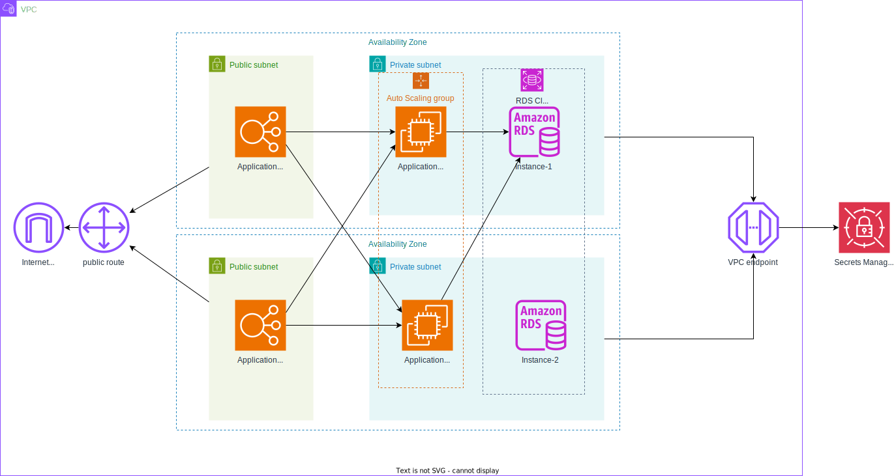

# フェーズ 1: 設計のプランニングと費用の見積もりをする
## タスク1：アーキテクチャ図を作成する
このコースでは最終的に以下の構成の Web アプリケーションを構築します。  
ただし、以下の前提条件に従って、RDS はシングルインスタンスで構築します。  
__データベースは 1 つのアベイラビリティーゾーンでのみホストされます。__

このアーキテクチャ図は、[draw.io](https://app.diagrams.net/) で作成しました。

### 演習
draw.io を使用して前述のアーキテクチャ図を作成してください。

各サービスのアイコンは以下のカテゴリ内にありますので、必要なアイコンを選択してアーキテクチャ図を作成してください。
- AWS / Groups
    - VPC
    - Public Subnet
    - Private Subnet
    - Availability Zone
    - Auto Scaling Group
- AWS / Compute
    - EC2
    - Elastic Loadbalancer(Application Load Balancer)
- AWS / Database
    - RDS
    - RDS Instance
- AWS / Network & Content Delivery
    - Internet Gateway
    - Router
    - Endpoint(VPC Endpoint)
- AWS / Security, Identity & Compliance
    - Secrets Manager

## タスク２：費用見積書の作成
us-east-1 リージョンで 12 か月間ソリューションを実行するコストを見積もります。

### 演習
[AWS Pricing Calculator](https://calculator.aws/#/) を使用して、以下のサービスを利用する場合の費用見積書を作成してください。
- EC2
- RDS for MySQL
- Application Load Balancer
