# フェーズ 2: 基本的な機能を備えたウェブアプリケーションを作成する
このフェーズでは以下の構成のシステムを作成します。


## タスク 1: 仮想ネットワークを作成する
AWS Management Console を開き、以下の手順で仮想ネットワークを作成します。

### VPC を作成する
1. 検索窓に「VPC」と入力し、VPC サービスに移動
2. 左のメニューから「お使いの VPC」を選択
3. 「VPC を作成」を選択
4. 以下の情報を入力して「VPC を作成」を選択
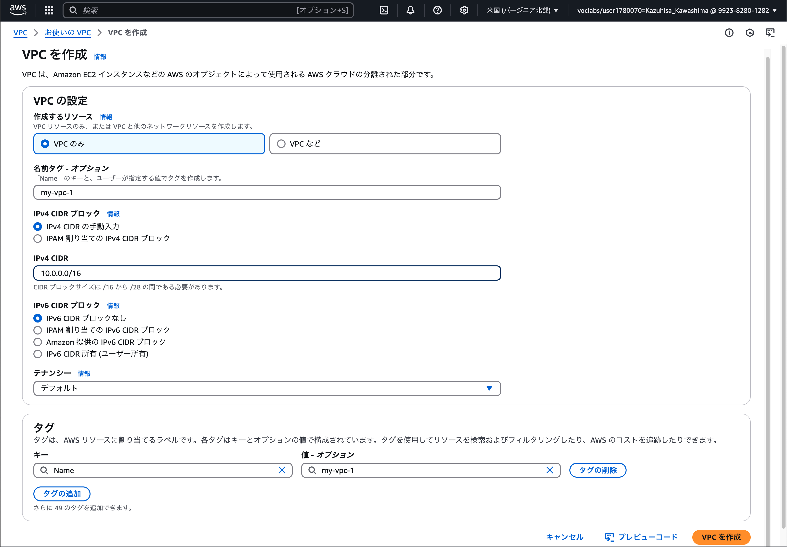

### サブネットを作成する
1. 検索窓に「VPC」と入力し、VPC サービスに移動
2. 左のメニューから「サブネット」を選択
3. 「サブネットを作成」を選択
4. VPC ID で作成した VPC を選択
5. 以下の情報を入力して「サブネットを作成」を選択
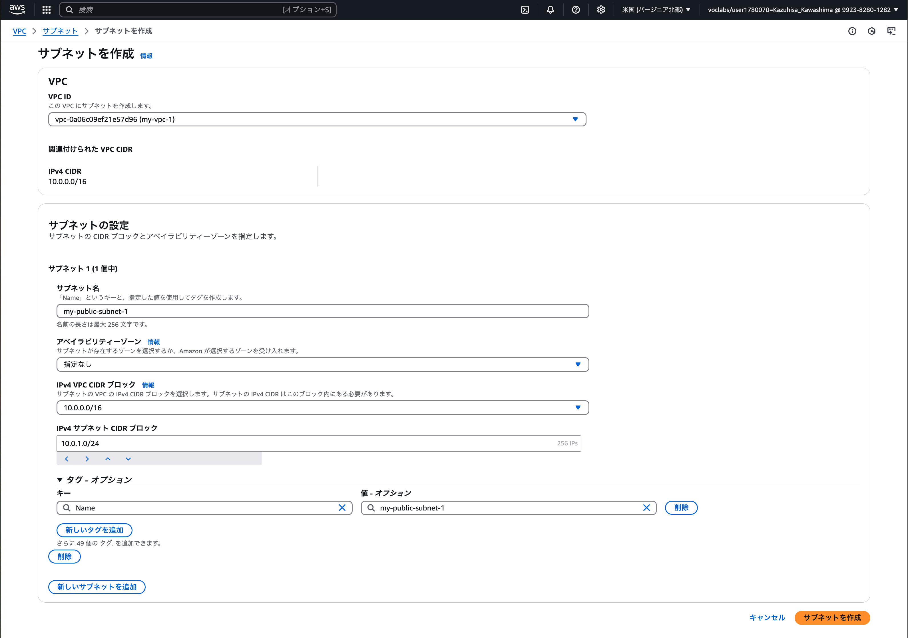

### インターネットゲートウェイを作成する
1. 検索窓に「VPC」と入力し、VPC サービスに移動
2. 左のメニューから「インターネットゲートウェイ」を選択
3. 「インターネットゲートウェイの作成」を選択
4. 以下の情報を入力して「インターネットゲートウェイの作成」を選択
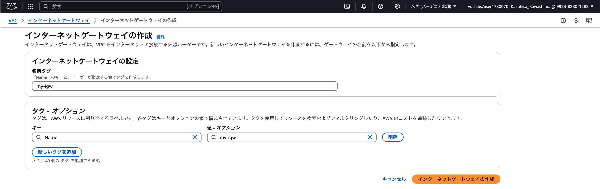
5. 「アクション」→「VPC にアタッチ」を選択
6. 作成した VPC を選択し、「インターネットゲートウェイのアタッチ」を選択
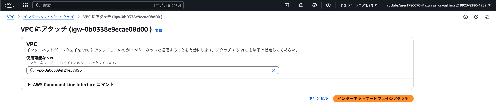

### ルートテーブルを作成する
1. 検索窓に「VPC」と入力し、VPC サービスに移動
2. 左のメニューから「ルートテーブル」を選択
3. 「ルートテーブルを作成」を選択
4. 以下の情報を入力して「ルートテーブルを作成」を選択
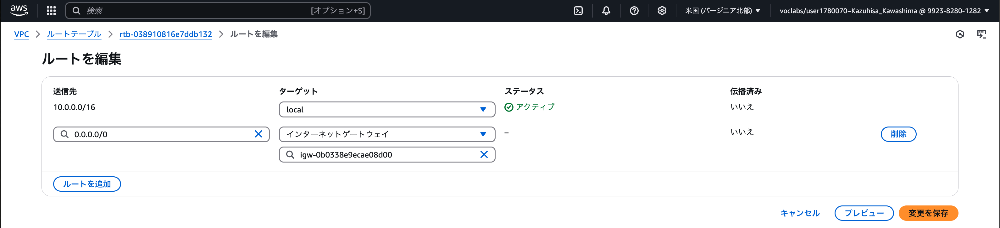
5. 「ルートを編集」を選択
6. 「ルートを追加」を選択し、以下のように作成したインテーネットゲートウェイへのルートを追加
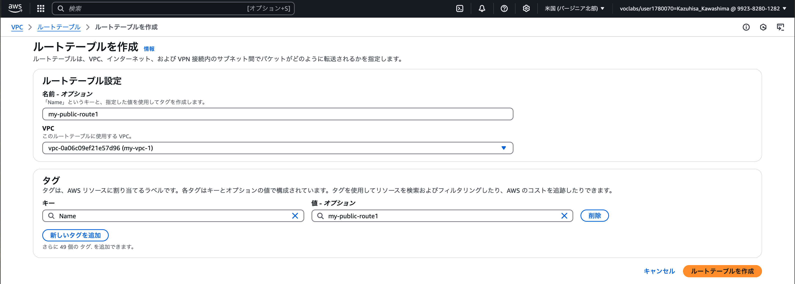
7. 「変更を保存」を選択
8. 「サブネットの関連付け」タブを選択
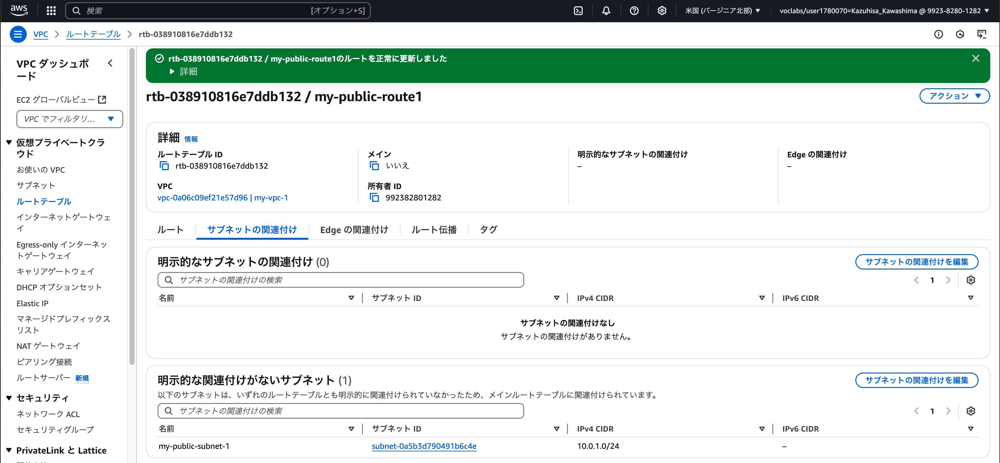
9. 「サブネットの関連付け」を選択
10. 作成したサブネットを選択し、「関連付けを保存」を選択
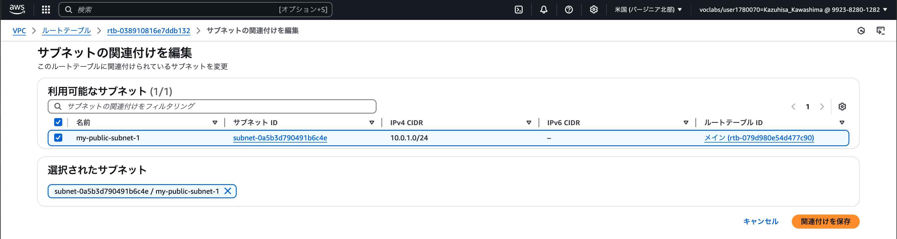

## タスク 2: 仮想マシンを作成する
E2 インスタンスを作成してアプリケーションをホストします。

### EC2 インスタンスを作成する
1. 検索窓に「EC2」と入力し、EC2 サービスに移動
2. 左のメニューから「インスタンス」を選択
3. 「インスタンスを起動」を選択
4. 以下の情報を入力して「インスタンスを起動」を選択
    - 名前: 任意の値
    - Amazon Machine Image (AMI): Ubuntu
    - インスタンスタイプ: t3.micro
    - キーペア: vockey
    - ネットワーク設定  
    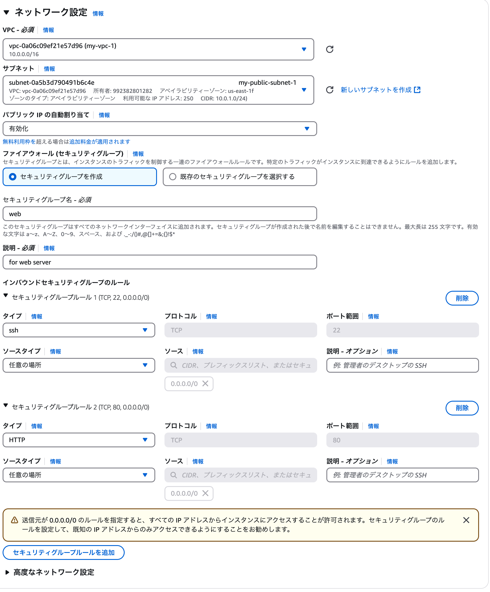
        - セキュリティグループのルールには、ssh と HTTP のルールを追加してください
6. 「高度な設定」を開く
7. 「ユーザーデータ」に Web Application Builder からダウンロードしたSolutionCodePOC(UserdataScript-phase-2.sh)を設定する
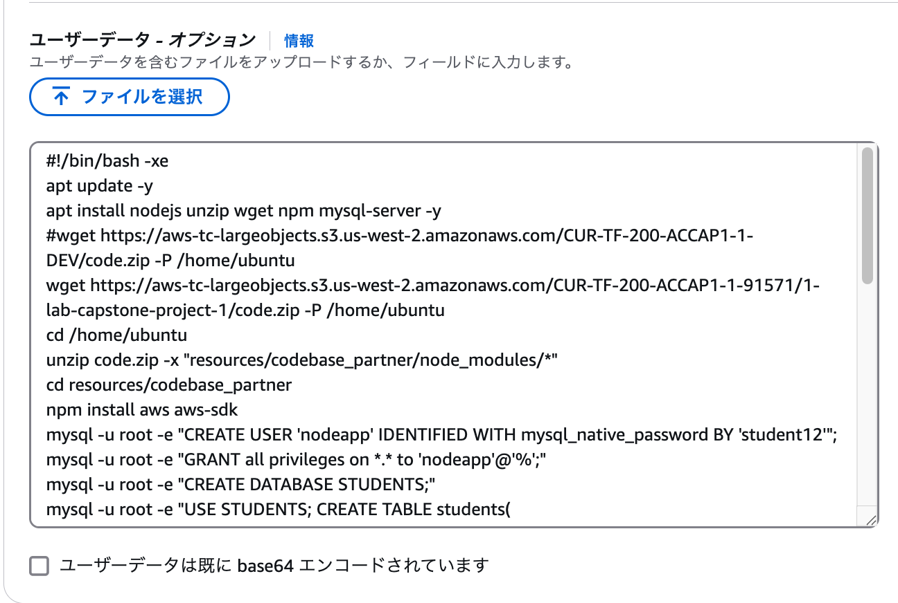
8. 「インスタンスを起動」を選択

## タスク 3: デプロイをテストする
EC2 インスタンスが起動したら、EC2 インスタンスのパブリック IP アドレスを確認し、ブラウザでアクセスします。

以下の画面が表示されれば成功です。


以降のフェーズで生徒の情報が必要となるので、数名の生徒の情報を登録してください。


アプリケーションの画面が表示されない場合は、次のトラブルシューティングの内容を確認しましょう。

## トラブルシューティング
1. EC2 インスタンスのイメージは、Ubuntuを選択しているか？

2. EC2 インスタンスにパブリック IP アドレスが割り当てられているか？
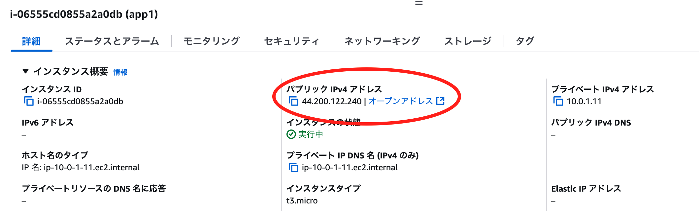

3. セキュリティグループが正しく設定されているか？
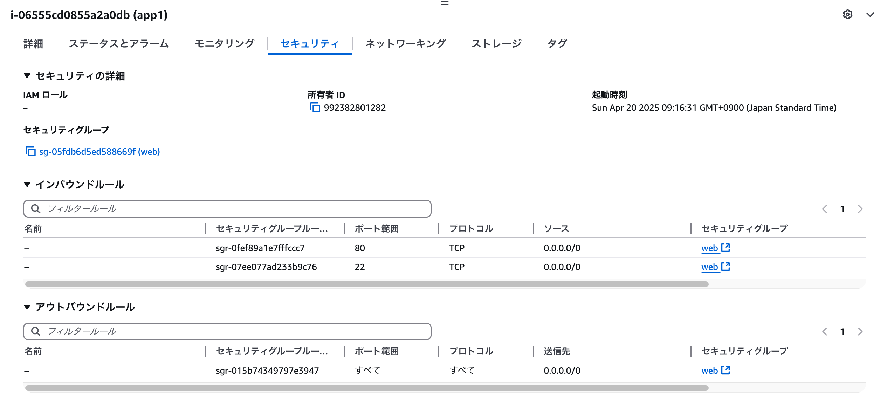

4. Web ブラウザから `http` でアクセスしているか？

5. アプリケーションが正しくインストールされているか？  
EC2 インスタンスに SSH で接続し、以下のコマンドを実行してアプリケーションが正しくインストールされているか確認します。
    ```bash
    cat /var/log/cloud-init-output.log
    ```
