# フェーズ 3: アプリケーションコンポーネントをデカップリングする
フェーズ 1で作成した構成図に従って、VPC、サブネットを作成し、アプリケーションコンポーネントをデカップリングします。これにより、アプリケーションサーバとデータベースサーバを分離します。



## タスク 1: VPC 設定を変更する
フェーズ 2に作成した VPC にサブネットを追加します。

- Public サブネットを 1つ
    - VPC ID: フェーズ 2で作成した VPC
    - サブネット名: 任意の値
    - アベイラビリティゾーン: フェーズ 2で作成した Public サブネットと違う値
    - IPv4 サブネット CIDR ブロック: 任意の値
- Private サブネットを 2つ
    - VPC ID: フェーズ 2で作成した VPC
    - サブネット名: 任意の値
    - アベイラビリティゾーン: Public サブネットと同じ値
    - IPv4 サブネット CIDR ブロック: 任意の値

### Point
- サブネットの作成方法は、フェーズ 2を参照
- サブネットを配置するアベイラビリティゾーンに注意する
- Public サブネットはフェーズ 2で作成したルートテーブルに関連付ける
  - ルートテーブルとサブネットの関連付けの方法は、フェーズ 2を参照
- このタスクが完了した時点でリソースマップは以下のようになる
  

## タスク 2: Amazon RDS データベースを作成して設定する
以下のリソースを作成し RDS を構築します。

- セキュリティグループ
- サブネットグループ
- RDS

### セキュリティグループを作成する
1. 検索窓に「VPC」と入力し、VPC サービスに移動
2. 左のメニューから「セキュリティグループ」を選択
3. 右上の「セキュリティグループを作成」を選択
4. 以下の情報を入力して「セキュリティグループを作成」を選択


### サブネットグループを作成する
1. 検索窓に「RDS」と入力し、Aurora and RDS サービスに移動
2. 左のメニューから「サブネットグループ」を選択
3. 右上の「DB サブネットグループを作成」を選択
4. 以下の情報を入力して「作成」を選択


### RDS を作成する
1. 検索窓に「RDS」と入力し、Aurora and RDS サービスに移動
2. 左のメニューから「データベース」を選択
3. 右上の「データベースを作成」を選択
4. 以下の情報を入力して「データベースの作成」を選択


RDS の作成には数十分かかるのでしばらく待つ (ステータスが「利用可能」になるまで)

## タスク 3: 開発環境を設定する
Web Application Builder では、mysql コマンドと aws コマンドを使用します。このタスクでは、これらのコマンドを利用できる環境を用意します。

ラボの手順では AWS Cloud 9 環境を用意する手順が記載されていますが、[AWS Cloud 9 は廃止予定のサービス](https://docs.aws.amazon.com/cloud9/latest/user-guide/welcome.html)のため、フェーズ 2で作成した EC2 インスタンスを利用します。

### EC2 インスタンスに SSH 接続する
1. 検索窓に「EC2」と入力し、EC2 サービスに移動
2. 左のメニューから「インスタンス」を選択
3. フェーズ 2で作成した EC2 インスタンスを選択
4. EC2 インスタンスの Public IPv4 アドレスを使用して SSH 接続


### aws コマンドをインストールする
1. SSH 接続した EC2 インスタンスに以下のコマンドを実行して aws コマンドをインストールする

    ```
    sudo snap install aws-cli --classic
    ```

2. aws コマンドのバージョンを確認する

    ```
    aws --version
    ```
    以下のようにバージョンが表示されれば成功です。

    ```
    aws-cli/2.27.5 Python/3.13.2 Linux/6.8.0-1024-aws exe/x86_64.ubuntu.2404
    ```

### aws コマンドの認証情報をセットアップする
1. AWS Academy のページに移動する
2. 画面右上の「AWS Details」を選択
3. AWS CLI の「Show」ボタンを選択
4. 表示された以下の値をコピーする

    ```
    [default]
    aws_access_key_id=XXXXXXXXXXXXXXXX
    aws_secret_access_key=YYYYYYYYYYYYYYYYYYYYYYYYYYYYYYYYYYYYY
    aws_session_token=ZZZZZZZZZZZZZZZZZZZZZZZZZZZZZZZZZZZZZZ
    ```

5. SSH 接続した EC2 インスタンスに戻り、以下を実施する  
    `~/.aws/credentials` ファイルを作成し、先ほどコピーした値を貼り付ける

6. aws コマンドで AWS 環境に接続できる確認する

    ```
    aws ec2 describe-instances --region us-east-1
    ```

    EC2 インスタンスの情報が表示されれば成功です。

### mysql コマンドをインストールする
mysql コマンドはフェーズ 2で作成した EC2 インスタンスにインストールされています。

以下のコマンドを実行してください。

```bash
mysql --version
```

以下のようにバージョンが表示されれば成功です。

```bash
mysql  Ver 8.0.41-0ubuntu0.24.04.1 for Linux on x86_64 ((Ubuntu))
```

## タスク 4: Secrets Manager をプロビジョニングする
Secrets Manager に RDS の接続情報を登録します。

以下のファイルの `Script-1` に記載されているコマンドを実行します。

[AWS Cloud9 Scripts](https://aws-tc-largeobjects.s3.us-west-2.amazonaws.com/CUR-TF-200-ACCAP1-1-91571/1-lab-capstone-project-1/s3/cloud9-scripts.yml)

上記コマンドの以下のパラメータは自身の環境に合わせて変更してください。

- `<username>`: RDS のマスターユーザー名
- `<password>`: RDS のマスターパスワード
- `<RDS Endpoint>`: RDS のエンドポイント
- `<dbname>`: STUDENTS

## タスク 5: ウェブサーバーの新しいインスタンスをプロビジョニングする
1. 検索窓に「EC2」と入力し、EC2 サービスに移動
2. 左のメニューから「インスタンス」を選択
3. 「インスタンスを起動」を選択
4. 以下の情報を入力して「インスタンスを起動」を選択
    - 名前: 任意の値
    - Amazon Machine Image (AMI): Ubuntu
    - インスタンスタイプ: t3.micro
    - キーペア: vockey
    - ネットワーク設定  
      
5. 「高度な設定」を開く
6. IAM インスタンスプロファイルを設定 (Secret Manager へのアクセスする権限を付与)
    
8. 「ユーザーデータ」に Web Application Builder からダウンロードした[Solution Code for the App Server](https://aws-tc-largeobjects.s3.us-west-2.amazonaws.com/CUR-TF-200-ACCAP1-1-91571/1-lab-capstone-project-1/s3/UserdataScript-phase-3.sh)を設定する
9. 「インスタンスを起動」を選択
10. EC2 インスタンスが起動したら、再起動する

## タスク 6: データベースを移行する
フェーズ2 で作成した EC2 インスタンスで動作しているデータベースをタスク2 で作成した RDS に移行します。

この作業はフェーズ2 で作成した EC2 インスタンスに SSH 接続して実施します。

### データベースをエクスポートする
以下のコマンドを実行してデータベースをエクスポートする

```bash
mysqldump -h 127.0.0.1 -u nodeapp -p --databases STUDENTS > data.sql
```

- パスワードは、`student12`

### データベースをインポートする
以下のコマンドを実行してデータベースをインポートする

```bash
mysql -h <RDSEndpoint> -u <username> -p < data.sql
```

- `<RDSEndpoint>` は RDS のエンドポイントに置き換える
- `<username>` は RDS のマスターユーザー名に置き換える
- パスワードは、RDS のマスターパスワード

## タスク 7: アプリケーションをテストする
本フェーズで作成した EC2 インスタンスの Public IPv4 アドレスにブラウザからアクセスします。
フェーズ　2で登録した生徒の情報が表示されれば成功です。
