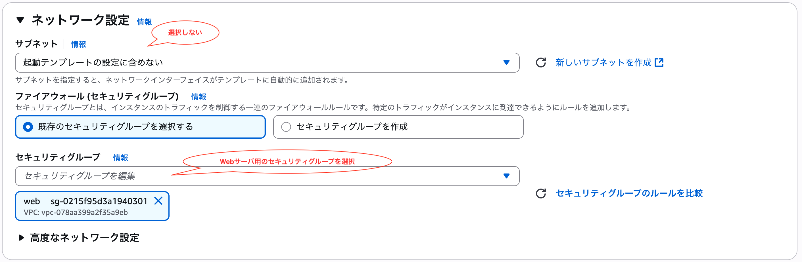

# フェーズ 4: 高可用性とスケーラビリティを実装する
フェーズ 1で作成して構成図に従って、アプリケーションの高可用性とスケーラビリティを実装します。これにより、アプリケーションの可用性を向上させ、トラフィックの増加に対応できるようになります。


## タスク 0: 不足しているネットワークリソースを作成する
フェーズ1, 2, 3で作成したネットワークは以下が不足しているため、作成します。
- VPC endpoint

### VPC endpoint 用のセキュリティグループを作成する
1. 検索窓に「VPC」と入力し、VPC サービスに移動
2. 左のメニューから「セキュリティグループ」を選択
3. 右上の「セキュリティグループを作成」を選択
4. 以下の情報を入力して「セキュリティグループを作成」を選択
   - セキュリティグループ名: 任意の値
   - 説明: 任意の値
   - VPC: フェーズ 2で作成した VPC
   - インバウンドルール:
      - タイプ: HTTPS
      - ソース: 10.0.0.0/16
   - アウトバウンドルール: 変更しない


### VPC endpoint
1. 検索窓に「VPC」と入力し、VPC サービスに移動
2. 左のメニューから「エンドポイント」を選択
3. 右上の「エンドポイントを作成」を選択
4. エンドポインの設定を入力
   - 名前タグ: 任意の値
   - タイプ: AWS のサービス


5. サービスを選択  
   検索窓に「secretsmanager」と入力し、表示された以下のサービスを選択

   - サービス: com.amazonaws.us-east-1.secretsmanager


6. VPC とサブネットを設定
   - VPC: フェーズ 2で作成した VPC
   - サブネット: フェーズ 2で作成した Private サブネットを選択


7. セキュリティグループを設定  
   VPC endpoint 用に作成したセキュリティグループを選択


8. 「エンドポイントを作成」を押す

### マシンイメージを作成する
フェーズ 3で作成した EC2 インスタンスから、Auto Scaling グループで使用するマシンイメージを作成します。

1. 検索窓に「EC2」と入力し、EC2 サービスに移動
2. 左のメニューから「インスタンス」を選択
3. フェーズ 3で作成した EC2 インスタンスを選択
4. 右上の「アクション」を選択し、「イメージとテンプレート」から「イメージを作成」を選択


5. 以下の情報を入力
   - イメージ名: 任意の値
   - イメージの説明: 任意の値
6. 「イメージを作成」を選択


7. 左のメニューから「AMI」を選択し、作成した AMI を確認する


### 起動テンプレートを作成する
1. 検索窓に「EC2」と入力し、EC2 サービスに移動
2. 左のメニューから「起動テンプレート」を選択
3. 右上の「起動テンプレートを作成」を選択
4. 以下の情報を入力
   - 起動テンプレート名: 任意の値
   - テンプレートバージョンの説明: 任意の値


   - Amazon マシンイメージ (AMI): 作成した AMI


   - インスタンスタイプ: t3.micro


   - キーペア: vockey を選択


   - ネットワーク設定:
     - サブネット: 選択しない
     - セキュリティグループ: フェーズ 2で作成した Web サーバー用のセキュリティグループを選択



   - ストレージ (ボリューム): デフォルトのまま


   - リソースタグ: 「新規タグを追加」を押して追加する
       - キー: Name
       - 値: 任意の値
       - リソースタイプ: インスタンス


   - 高度な詳細: 開いて以下を設定する
      - IAM インスタンスプロファイル: 「LabInstanceProfile」を選択


5. 「起動テンプレートを作成」を選択

## タスク 1: Application Load Balancer を作成する
1. 検索窓に「EC2」と入力し、EC2 サービスに移動
2. 左のメニューから「ロードバランサー」を選択
3. 右上の「ロードバランサーの作成」を選択
4. 「Application Load Balancer」を選択し、「作成」を選択


5. 基本的な設定
   - ロードバランサー名: 任意の値
   - スキーム: インターネット向け
   - ロードバランサーの IP アドレスタイプ: IPv4


6. ネットワークマッピング
   - VPC: フェーズ 2で作成した VPC
   - アベイラビリティゾーンとサブネット: フェーズ 2, 3で作成した Public サブネットを選択


7. セキュリティグループ
   - フェーズ 2で作成した Web サーバー用のセキュリティグループを選択


8. ターゲットグループを作成  
   「ターゲットグループの作成」を押してターゲットグループを作成する

   - ターゲットグループ名: 任意の値
   - vpc: フェーズ 2で作成した VPC


   ロードバランサーの設定に戻る

9. リスナーとルーティング
   - プロトコル: HTTP
   - ポート: 80
   - ターゲットグループ: 作成したターゲットグループを選択


10. 「ロードバランサーの作成」を押す

## タスク 2: Amazon EC2 Auto Scaling を実装する
1. 検索窓に「EC2」と入力し、EC2 サービスに移動
2. 左のメニューから「Auto Scaling グループ」を選択
3. 右上の「Auto Scaling グループを作成」を選択
4. 起動テンプレートを選択
   - 名前: 任意の値
   - 起動テンプレート: 作成した起動テンプレートを選択
   - バージョン: 最新のバージョンを選択


5. インスタンス起動オプションを選択する
   - VPC: フェーズ 2で作成した VPC
   - アベイラビリティゾーンとサブネット: フェーズ 3で作成した Private サブネットを 2つ選択


6. 他のサービスと統合する
   - ロードバランシング: 既存のロードバランサーにアタッチする
   - ロードバランサー: 作成した Application Load Balancer を選択


7. ヘルスチェック
   - Elastic Load Balancing のヘルスチェックをオンにする: チェックする


8. グループサイズ / スケーリング
   - 希望するキャパシティ: 2
   - 最小の希望する容量: 2
   - 最大の希望する容量: 4
   - 自動スケーリング: 「ターゲット追跡スケーリングポリシー」を選択


9. その他設定


10. 通知を追加する
   そのまま「次へ」を押す

11. タグを追加する
   そのまま「次へ」を押す

12. 「Auto Scaling グループを作成する」を押す

## タスク 3: アプリケーションにアクセスする
タスク 2 を完了すると、Auto Scaling グループにより EC2 インスタンスが起動され、ターゲットグループに登録されます。これにより、Application Load Balancer を通じてアプリケーションにアクセスできるようになります。

1. EC2 サービスに移動して、EC2 インスタンスが起動されていることを確認します。
2. ターゲットグループに移動して、登録済みターゲットに EC2 インスタンスが表示されていることを確認します。


3. ロードバランサーの DNS 名で Web ブラウザからアプリケーションにアクセスします。  
   ロードバランサーの DNS 名は、EC2 サービスの「ロードバランサー」から確認できます。


## タスク 4: アプリケーションに負荷テストを実施する
1. apache benchmark をインストールします。

```bash
sudo apt install apache2-utils
```

2. 以下のコマンドを実行して、アプリケーションに負荷テストを実施します。

```bash
ab -n 10000000 -c 100 -k http://<ELB の DNS 名>/students
```

3. Auto Scaling グループのスケーリングの設定に従って EC2 インスタンスがスケールアウトすることを確認します。
