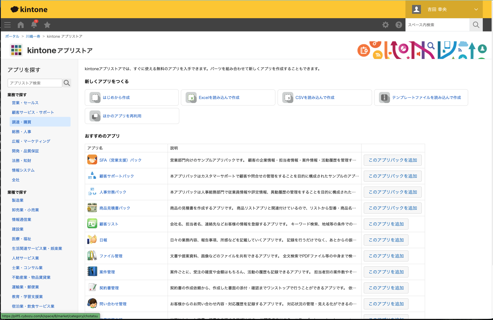
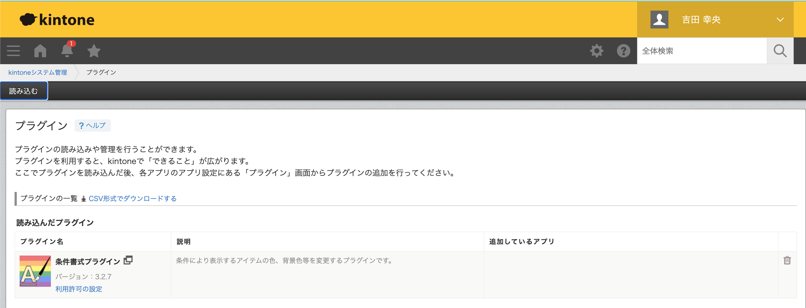
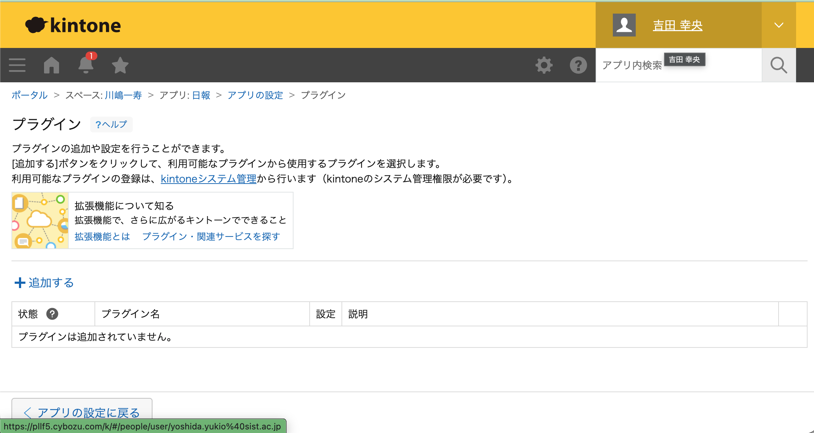
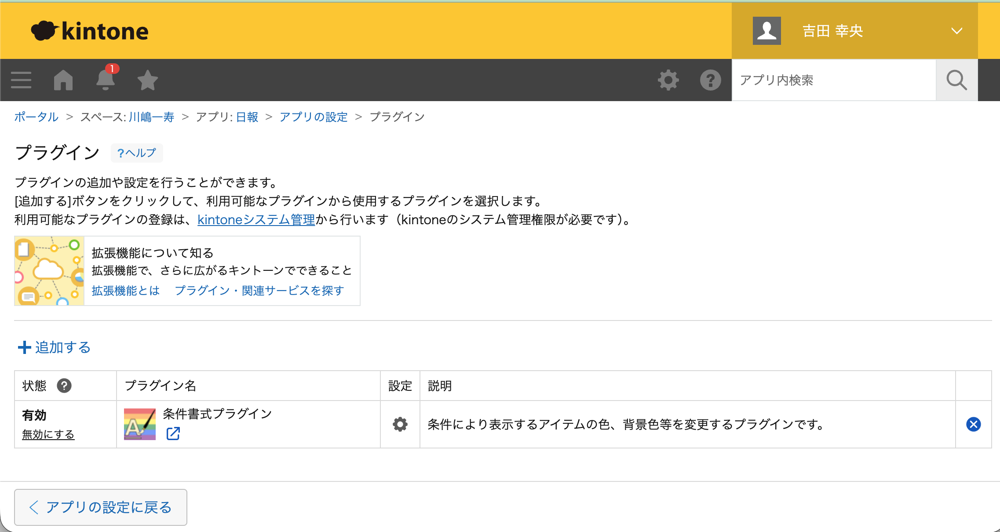
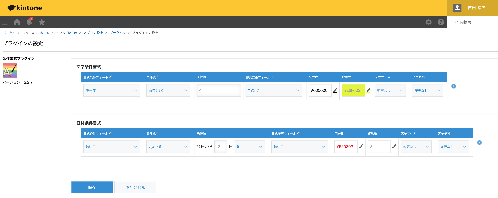
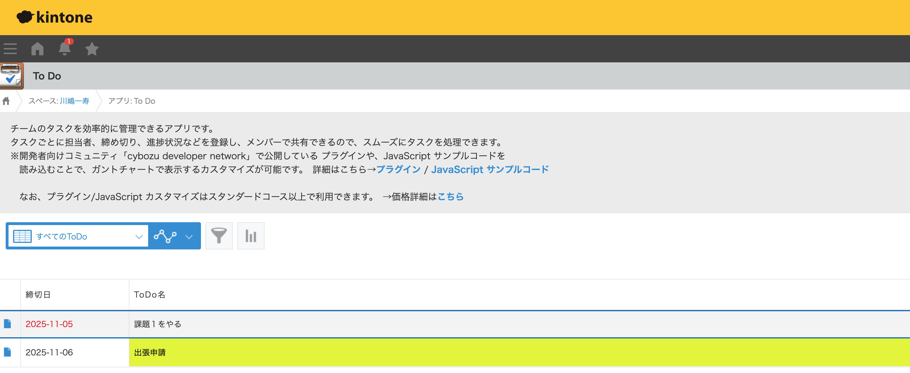

# プラグイン

## 概要

kintoneプラグインは、kintoneアプリの機能を拡張するためのパッケージです。JavaScript、CSS、画像などのファイルを組み合わせて、アプリに独自の機能を追加できます。

### プラグインの特徴

- **アプリの機能拡張**: 標準機能では実現できない独自の業務要件に対応
- **再利用可能**: 一度作成したプラグインを複数のアプリで利用可能
- **設定画面の提供**: プラグイン固有の設定画面を用意し、ユーザーが柔軟に設定変更可能
- **パッケージ化**: zipファイルとして配布・インストールが容易

## プラグインの利用方法
アプリでプラグインを利用するには、kintone システム管理者が、kintone システム管理画面からアプリで利用するプラグインを追加する必要があります。

ここでは、kintone アプリストアで公開されている 「To Do アプリ」に cybozu developer network で提供されているサンプルプラグインの「[条件書式プラグイン](https://cybozu.dev/ja/kintone/tips/development/plugins/sample-plugin/conditionformat-v2-plugin/)」を追加する手順を例に説明します。

### To Do アプリの追加手順
1. [kintone アプリストア](https://pllf5.cybozu.com/k/space/8/market)にアクセスします。

    

2. 検索ボックスに「To Do」と入力し、表示された一覧から「To Do アプリ」を追加します。

    

### To Do アプリにレコードを追加する
レコードのフォームは以下のようになっています。

いくつかレコードを追加してください。

### kintone システム管理画面でのプラグインの追加手順
1. 画面右上の歯車アイコンをクリックし、「kintoneシステム管理」を選択します。

2. その他の「プラグイン」をクリックします。

    

3. 左上の「読み込む」をクリックします。

    

4. 「参照」ボタンをクリックし、追加したいプラグインのzipファイルを選択し、「読み込む」ボタンをクリックします。

    

    利用可能なプラグインは以下のサイトで検索することができます。  
    https://kintone-sol.cybozu.co.jp/integrate/

    サンプルプラグインを以下のサイトからダウンロードすることもできます。  
    https://cybozu.dev/ja/kintone/tips/development/plugins/sample-plugin/

6. プラグインの一覧に追加したプラグインが表示されます。

    

### アプリへのプラグインの追加手順
1. プラグインの設定画面を開きます。

    

2. 「＋追加する」をクリックします。

    

3. 追加したいプラグインを選択し、「追加」ボタンをクリックします。

    

4. 追加したプラグインが一覧に表示されます。

    

5. 追加したプラグインの「設定」をクリックし、プラグインの設定画面を開きます。

    

6. プラグインの設定画面で必要な設定を行い、「保存」ボタンをクリックします。
    - 優先度が、Aの場合に、ToDo 名の背景色を黄色に設定する
    - 締切日まで残り2日を切った場合に、締切日の文字色を赤に設定する

    

7. 一覧画面を表示するとプラグインの設定が反映されていることが確認できます。

    
