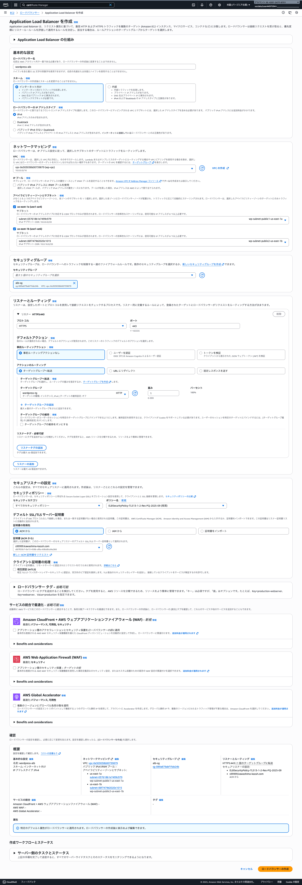
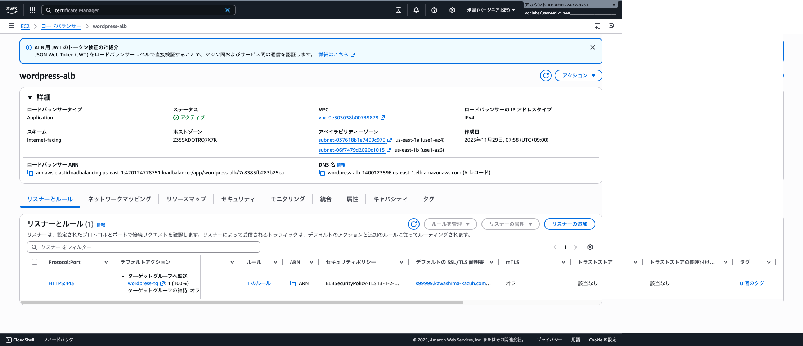

# ALB を構築する

## ALB を作成する
1. EC2 サービスに移動して、左メニューから「ロードバランシング」から「ロードバランサー」を選択し、「ロードバランサーの作成」を押します。

- ロードバランサータイプ: Application Load Balancer

- 基本的な設定
    - ロードバランサー名: alb
    - スキーム: 変更なし（インターネット向け）
    - ロ＝ドバランサーのタイプ: 変更なし（IPv4）
- ネットワークマッピング
    - VPC: 作成した VPC を選択
    - IP プール: 変更なし（チェックしない）
    - アベイラビリティーゾーンとサブネット: AZ を 2 つ選択し、パブリックサブネットを選択
- セキュリティグループ
    - [x] alb-sg を選択
    - [ ] default を外す
- リスナーとルーティング
    - プロトコル: HTTPS
    - ポート: 443
    - デフォルトアクション

