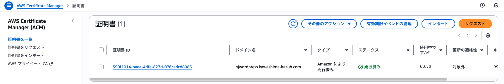
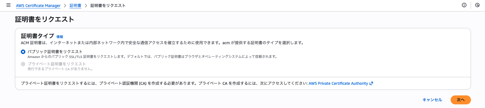
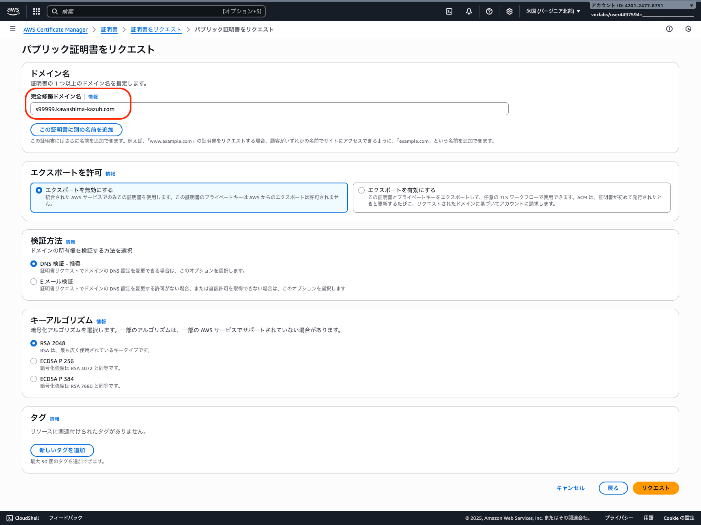
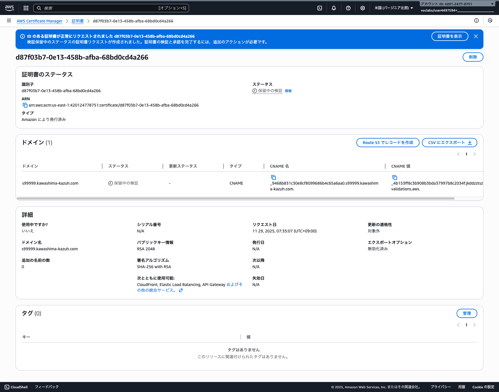
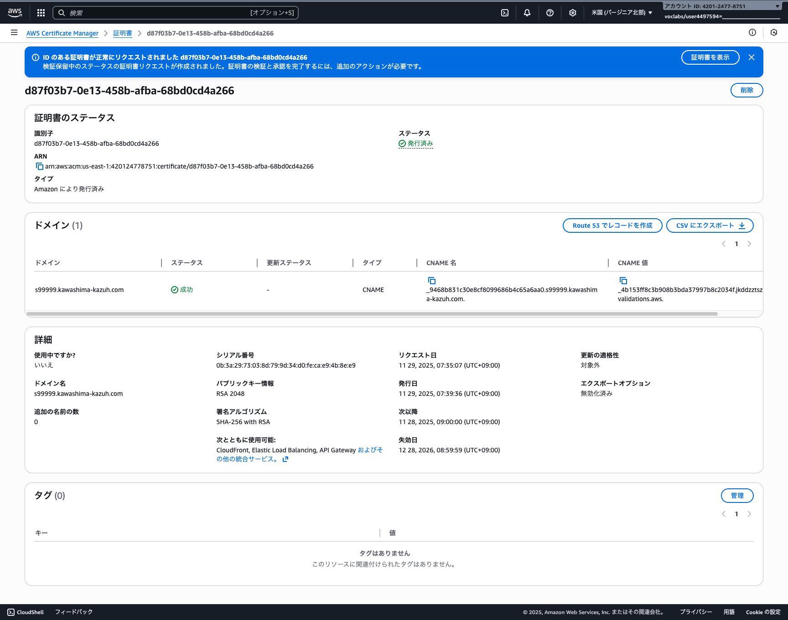

# 証明書を発行する
AWS Certificate Manager でドメイン用の SSL/TLS 証明書をリクエストします。

## Certificate Manager で証明書をリクエストする

### Certificate Manager ホーム画面を開く
Certificate Manager サービスに移動して、「リクエスト」を押します。

### リクエスト作成を開始する
「次へ」を押します。

## 証明書のドメイン情報を入力する

### 証明書をリクエストする
ドメイン名を入力して、「リクエスト」を押します。

## 証明書のリクエストを完了する

### リクエスト完了を確認する
証明書のリクエストが完了したことを確認します。

## DNS レコードを追加して証明書を検証する

### 検証用 CNAME レコード情報を確認する
CNAME名とCNAME値をコピーして、ドメインの DNS サーバーに CNAME レコードを追加します。

### ドメイン DNS サーバーに CNAME レコードを追加する
コピーした CNAME 名と CNAME 値を使用して、ドメインの DNS サーバーに CNAME レコードを追加します。

### 証明書の検証完了を確認する
DNS レコードの追加後、AWS が自動的に検証を行います。Certificate Manager のコンソールで証明書のステータスが「発行済み」になることを確認します。
