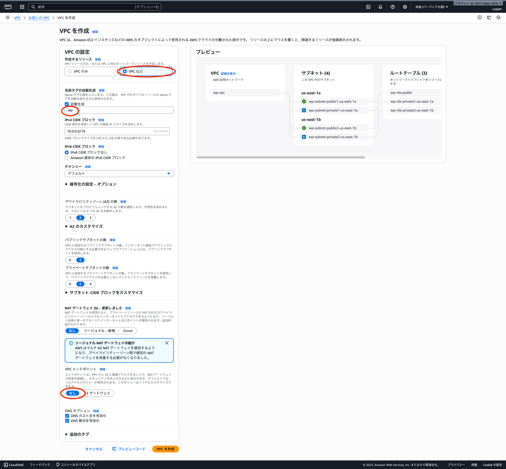
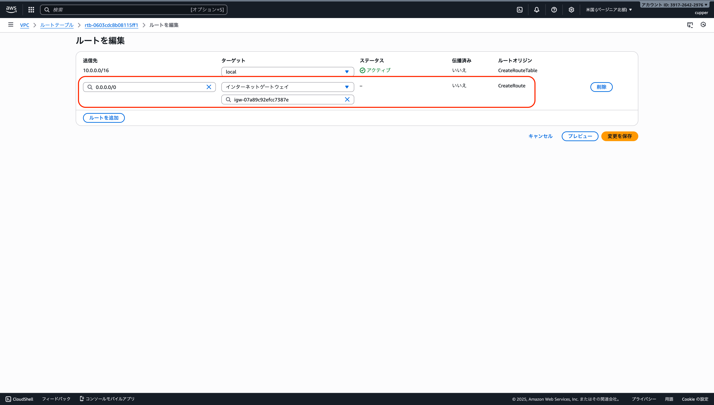
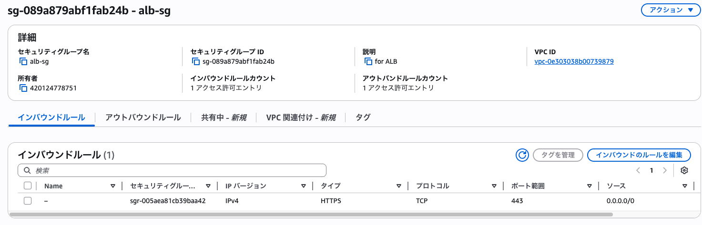
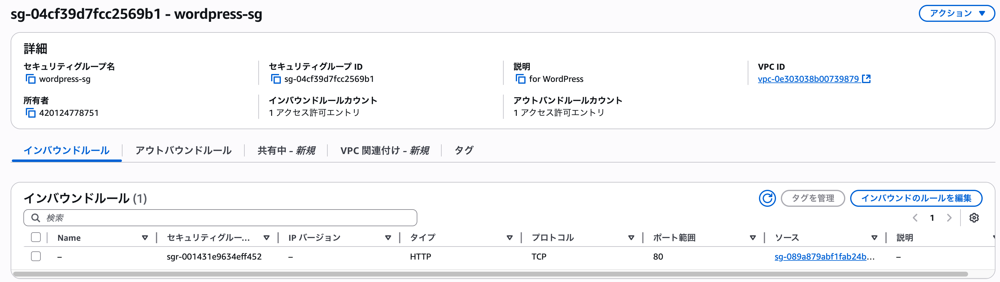

# ネットワークを構築する
以下のリソースを作成します。

- VPC
- インターネットゲートウェイ
- サブネット
    - Public Subnet x 2
    - Private Subnet x 2
- ルートテーブル
    - Public Route Table
    - Private Route Table
- セキュリティグループ
    - ALB 用
    - WordPress 
    - MariaDB 用

手順
1. VPC サービスに移動して、VPC を作成します。  
以下の図の赤丸部分はデフォルトから変更する箇所です。

Private Subnet からインターネットへは通信できない状態になっています。

2. Private Subnet のルートテーブルの定義に、インターネットゲートウェイへのルートを追加します。  
以下の図のように設定します。

Private Subnet のルートテーブルは、Subnet ごとに用意されているので、2 つの Private Subnet のルートテーブルそれぞれに対して設定を行います。

3. Private Subnet からの通信経路を確認する  
VPC のリソースマップを表示し、Private Subnet からインターネットゲートウェイへの通信経路が設定されていることを確認します。

4. セキュリティグループを作成する  
  以下のセキュリティグループを作成します。

    - bastion 用
        - セキュリティグループ名: bastion-sg
        - 説明: for bastion server
        - VPC: 作成した VPC を選択
        - インバウンドルール: なし
        - アウトバウンドルール: 変更なし（全て許可）
    - ALB 用
        - セキュリティグループ名: alb-sg
        - 説明: for ALB
        - VPC: 作成した VPC を選択
        - インバウンドルール:
            - HTTPS(443) を Anywhere-IPv4 (0.0.0.0/0) からの通信を許可
        - アウトバウンドルール: 変更なし（全て許可）
    - WordPress 用
        - セキュリティグループ名: wordpress-sg
        - 説明: for WordPress
        - VPC: 作成した VPC を選択
        - インバウンドルール:
            - HTTP(80) を ALB 用セキュリティグループからの通信を許可
            - SSH(22) を bastion 用セキュリティグループからの通信を許可
        - アウトバウンドルール: 変更なし（全て許可）
    - MariaDB 用
        - セキュリティグループ名: mariadb-sg
        - 説明: for MariaDB
        - VPC: 作成した VPC を選択
        - インバウンドルール:
            - MYSQL/Aurora(3306) を WordPress 用セキュリティグループからの通信を許可
            - SSH(22) を bastion 用セキュリティグループからの通信を許可
        - アウトバウンドルール: 変更なし（全て許可）

5. セキュリティグループの確認
  - ALB 用セキュリティグループ  
    
  - WordPress 用セキュリティグループ  
    
  - MariaDB 用セキュリティグループ  
    
