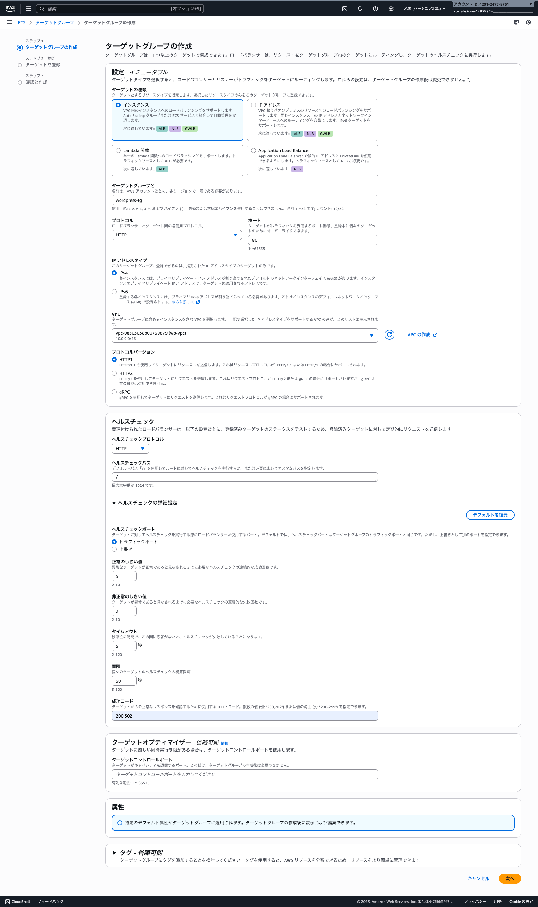
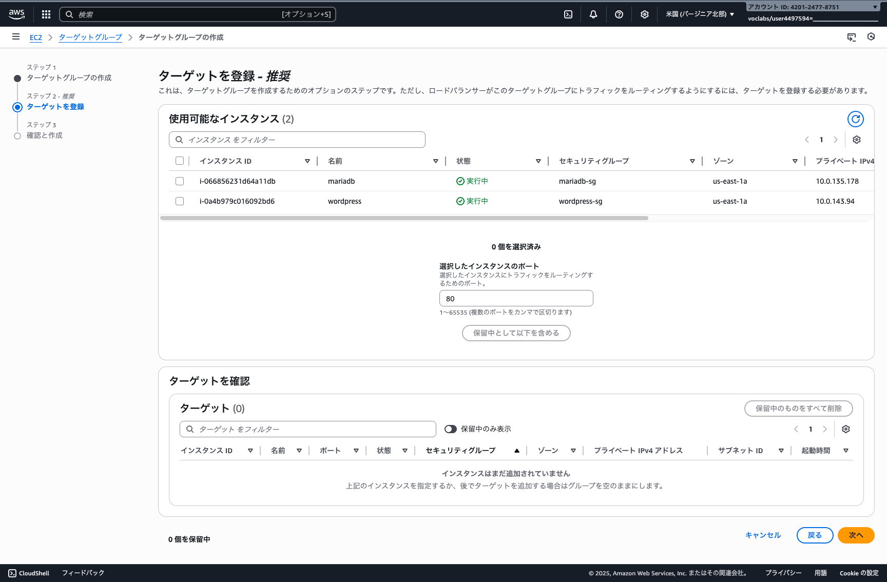
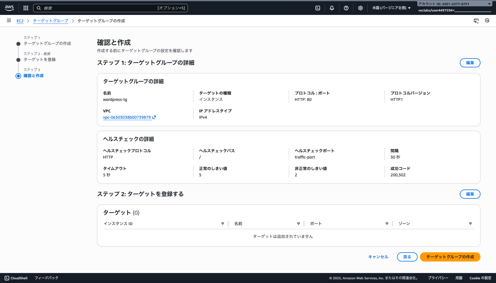

# ターゲットグループを作成する
ロードバランサーがトラフィックをルーティングするための対象を設定します。

## ターゲットグループの作成ウィザードを開く

### EC2 ロードバランシング ターゲットグループを選択する
EC2 サービスに移動して、左メニューから「ロードバランシング」から「ターゲットグループ」を選択し、「ターゲットグループの作成」を押します。

## ターゲットグループの基本設定を構成する

### ターゲットグループの設定情報を入力する
ターゲットグループの設定を以下のように構成します。

- ターゲットタイプ: インスタンス を選択
- ターゲットグループ名: wordpress-tg
- プロトコル: HTTP
- ポート: 80
- IP アドレスタイプ: IPv4
- VPC: 作成した VPC を選択
- プロトコルバージョン: HTTP1
- ヘルスチェック:
    - ヘルスチェックプロトコル: HTTP
    - ヘルスチェックパス: /

## ターゲットグループにターゲットを登録する

### WordPress サーバーインスタンスを登録する
使用可能なインスタンスから WordPress サーバーを選択し、「保留中として以下を含める」を押してターゲットとして登録します。

- 選択したインスタンスのポート: 80

## ターゲットグループの作成を完了する

### 作成内容を確認して完了する
設定内容を確認して、「ターゲットグループの作成」ボタンを押してターゲットグループを作成します。
