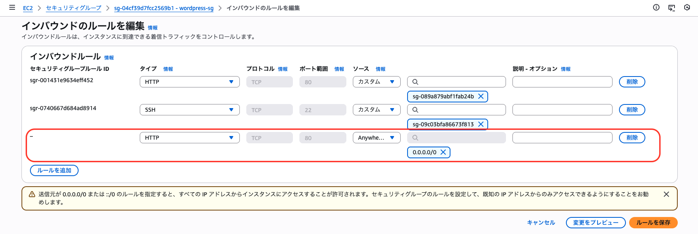
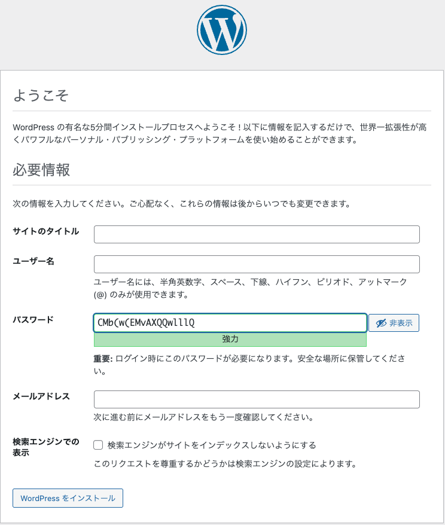

# WordPress サーバーを構築する

## EC2 インスタンスを起動する
EC2 サービスで WordPress サーバー用の EC2 インスタンスを作成します。

設定値の例は以下の通りです。

- 名前とタグ
    - 名前: wordpress
- アプリケーションおよび OS イメージ (Amazon マシンイメージ): 変更なし（Amazon Linux 2023）
- インスタンスタイプ: 変更なし
- キーペア:
    - キーペア名: vockey を選択
- ネットワーク設定: 「編集」を押して以下を設定する
    - VPC: 作成した VPC を選択
    - サブネット: Private Subnet のうちの 1 つを選択
    - パブリック IP の自動割り当て: 有効化を選択
    - ファイアウォール（セキュリティグループ）: 既存のセキュリティグループを選択し、WordPress 用セキュリティグループを選択
- ストレージを設定: 変更なし
    - 高度な詳細:
        - IAM インスタンスプロファイル: LabInstanceProfile を選択

## WordPress をインストールする

### EC2 インスタンスに接続する
1. EC2 インスタンスの一覧から wordpress を選択し、「接続」ボタンを押してセッションマネージャーで接続します。

2. ホームディレクトリに移動します。

    ```bash
    cd /home/ssm-user
    ```

    ```bash
    pwd
    /home/ssm-user
    ```

### 必要なパッケージをインストールする
以下のコマンドを実行して、WordPress に必要なパッケージをインストールします。

```bash
sudo dnf update -y
sudo dnf install wget php-mysqlnd httpd php-fpm php-mysqli php-json php php-devel -y
```

### WordPress をダウンロードする

```bash
wget https://ja.wordpress.org/wordpress-6.7.4-ja.zip
```

```bash
unzip wordpress-6.7.4-ja.zip
```

### wp-config.php を設定する

```bash
cp wordpress/wp-config-sample.php wordpress/wp-config.php
```

```bash
vi wordpress/wp-config.php
```

以下の設定を行います：

* DB_NAME を定義する行を探して、`database_name_here` を書き換える

```php
define('DB_NAME', 'wordpress-db');
```

* DB_USER を定義する行を探して、`username_here` を書き換える

```php
define('DB_USER', 'hjuser');
```

* DB_PASSWORD を定義する行を探して、`password_here` を書き換える

```php
define('DB_PASSWORD', 'password00');
```

* DB_HOST を定義する行を探して、`localhost` を書き換える

```php
define('DB_HOST', 'MariaDBサーバのPrivate IP');
```

* `Authentication unique keys and salts.` セクションを探して、`define` で始まる8行を以下で置き換える：

```php
define('AUTH_KEY',         ' #U$$+[RXN8:b^-L 0(WU_+ c+WFkI~c]o]-bHw+)/A[wSiZ<Qb[mghEXcRh-');
define('SECURE_AUTH_KEY',  'Zsz._P=l/|y.Lq)XjlkwS1y5NJ76E6EJ.AV0pCKZZB*~*r ?6OeJT@;+(ndLg');
define('LOGGED_IN_KEY',    'ju}qwre3V*+8f_zOWf?{LlGsQ]Ye@2Jh^,8x>)Y |;([]Pi+LG#A4R?7N`YB3');
define('NONCE_KEY',        'P(g62HeZxEes|LnI^i=H,[XwK9I&[2s|:?0N}VJM%?;v2+;+^9eXUahg@::Cj');
define('AUTH_SALT',        'C$DpB4Hj[JK:?{ql`sRVa:{:7yShy(9A@5w+`Vb1fk%_-Bx*M4(qc[Qg%JT!h');
define('SECURE_AUTH_SALT', 'd!uRu#}+q#{f$Z?Z9uFPG.${+S{nM%@~gL>U>NV<zpD-@2-Es7Q1O-bp28EKv');
define('LOGGED_IN_SALT',   ';j{00P*owZf)kVD+FVLn-~ >.|Y%Ug4#I^*LVd9QeZ^XmK|e(76miC+&+^0P/');
define('NONCE_SALT',       '-97r*V/cgxLmp?Zy4zUU4r99QQ_rGs2LTd%P;|_e1tS8_,.6[=UK<J_y9?JWG');
```

* ファイル末尾（`/* That's all, stop editing! Happy publishing. */` の直前）に以下を追加：

```php
// ALB + HTTPS 対応
if (isset($_SERVER['HTTP_X_FORWARDED_PROTO']) && $_SERVER['HTTP_X_FORWARDED_PROTO'] === 'https') {
  $_SERVER['HTTPS'] = 'on';
  $_ENV['HTTPS'] = 'on';
}
```

### WordPress を Web サーバのディレクトリに配置する

```bash
sudo cp -r wordpress/* /var/www/html/
```

```bash
sudo chown -R apache:apache /var/www/html
```

### Apache の設定を変更する

```bash
sudo vi /etc/httpd/conf/httpd.conf
```

`<Directory "/var/www/html">` セクションを探して、`AllowOverride None` を `AllowOverride All` に変更します。

```apache
<Directory "/var/www/html">
    Options Indexes FollowSymLinks
    AllowOverride All
    Require all granted
</Directory>
```

### Web サーバを起動する

```bash
sudo systemctl start httpd
sudo systemctl enable httpd
```

### 動作確認を行う
WordPress サーバーのセキュリティグループにポート 80 を追加します。



Web ブラウザで WordPress サーバーのパブリック IP アドレスにアクセスします。  
以下の画面が表示されたら成功です。



